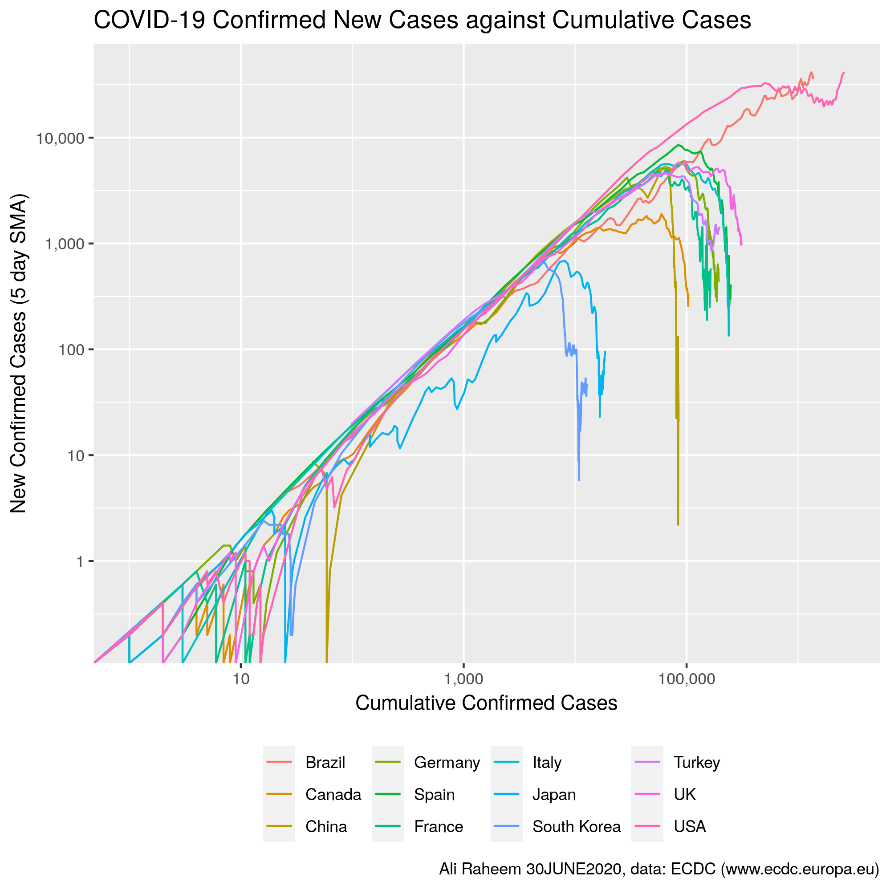

# The COVID-19 Railroad

Plotting New cases/deaths on Cumulative cases/deaths for COVID-19 (idea from [MinutePhysics](https://www.youtube.com/watch?v=54XLXg4fYsc)).

## Data source

* Europian Centre for Disease Prevention and Control - https://www.ecdc.europa.eu/en/publications-data/download-todays-data-geographic-distribution-covid-19-cases-worldwide
