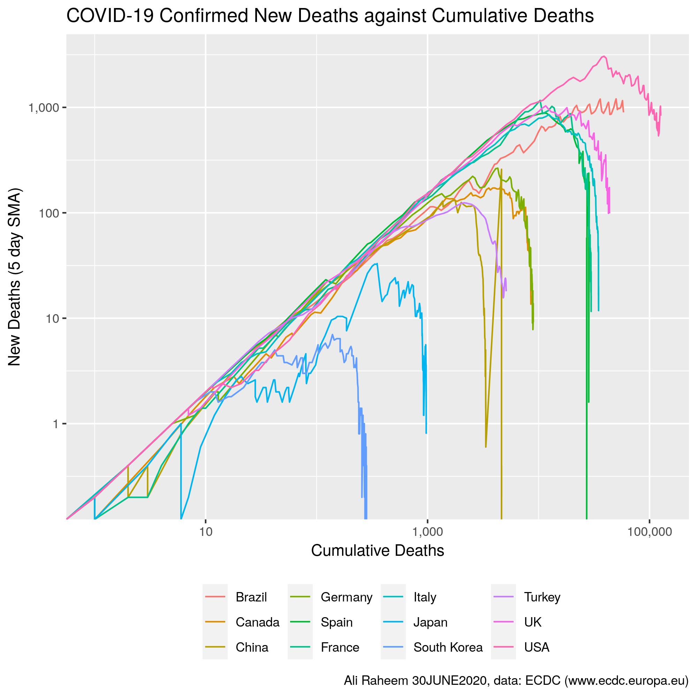
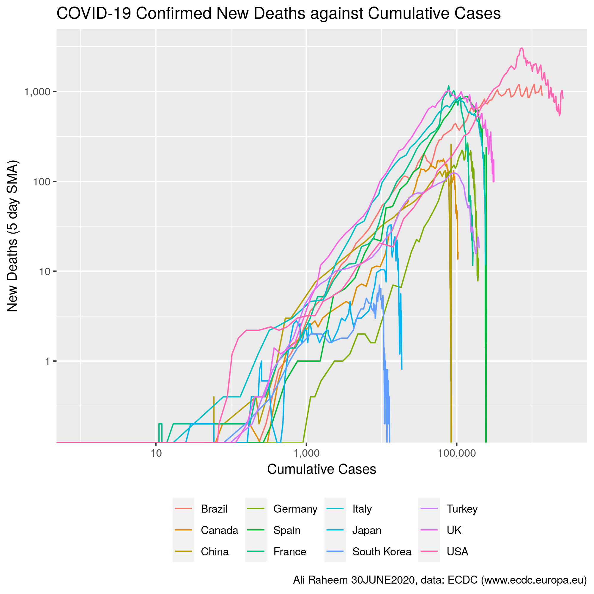
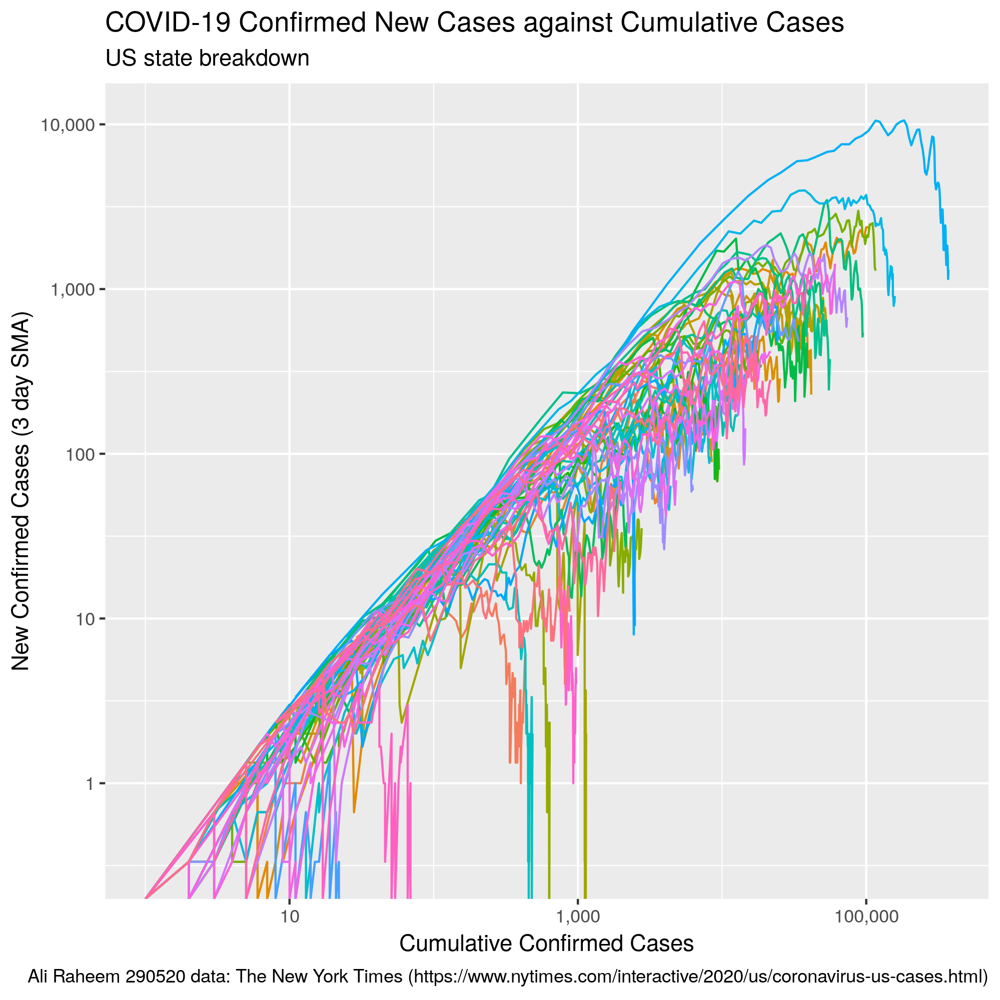

# The COVID-19 Railroad

Plotting New cases/deaths on Cumulative cases/deaths for COVID-19 (idea from [MinutePhysics](https://www.youtube.com/watch?v=54XLXg4fYsc)).

## Chart

### Worldwide

#### New Cases Against Cumulative Cases

This method of plotting removes the date as a way of staging the pandemic and instead focuses on where each country is in its own epidemic compared with others. It's very sensitive to countries that divert away from exponential growth like China and South Korea. An unexpected take away is that it seems once you have of the order of 100 cases you quickly slip into exponential growth (well done Japan for holding it together but they seem to be loosing grip on it too). This is looking at only confirmed cases, but so long as the bias in confirming cases isn't exponential it shouldn't effect categorising countries as in and out of exponential growth.

Smaller single charts for each country can be found in the python3 notebook [COVID-19.loglog.ipynb](COVID-19.loglog.ipynb), while code for the above graphic is in the R notebook [R.ipynb](R.ipynb).

#### New Deaths Against Cumulative Deaths

#### New Deaths Against Cumulative Cases

### United States

It's quite cluttered. But tentatively looking good? See [here](COVID-19_loglog_US.png) for a version with a (mostly useless) legend.

## Files

*	[R.ipynb](R.ipynb) - R based notebook produces the headline chart
* [COVID-19.loglog.ipynb](COVID-19.loglog.ipynb) - Python3 based notebook produces individual charts of each country in dataset
* [US.loglog.ipynb](US.loglog.ipynb) - R based noteboook for US chart data
* [loglogplots/](loglogplots/) - Folder of plots of cases and deaths by country

## Dependencies

You will need Jupyter, R, Python3

### Libraries
#### R
* tidyverse
* readxl

#### Python3
* matplotlib
* numpy
* scipy
* pandas

## Data source

### Worldwide
* Europian Centre for Disease Prevention and Control - https://www.ecdc.europa.eu/en/publications-data/download-todays-data-geographic-distribution-covid-19-cases-worldwide

### US
* NYTimes - https://github.com/nytimes/covid-19-data - https://www.nytimes.com/interactive/2020/us/coronavirus-us-cases.html
